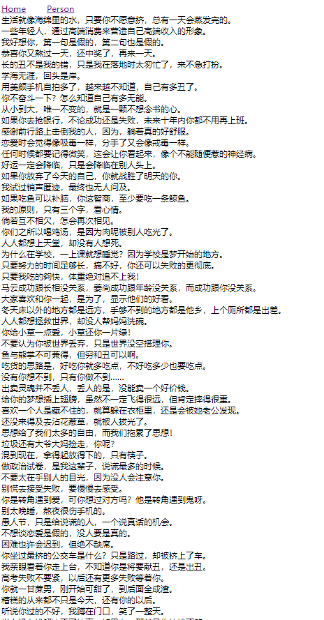

### react-ssr 数据同构

#### 写法
> 前端使用redux方式不变，后端需要给你静态路由的Provider提供一份store


1. 创建共用store,前后端共用一份store.
```
//src/store/index.js

import { createStore, applyMiddleware } from 'redux';
import thunk from 'redux-thunk'
import reducer from './reducer'
const store = createStore(reducer, applyMiddleware(thunk));
export default store;


//src/store/reducer.js

import { combineReducers } from 'redux'
import { homeReducer } from '../client/home/store'
export default combineReducers({
    home: homeReducer,
})

```
2. Home组件Store维护
```
//src/client/home/store/index.js
import homeReducer from './reducer';
import * as actionCreators from './actionCreators';
import * as actionTypes from './actionTypes';
export { homeReducer, actionCreators, actionTypes };


//src/client/home/store/reducer.js
import { CHANGE_LIST } from "./actionTypes";
const defaultState = {
    list: []
}

export default (state = defaultState, action) => {
    switch (action.type) {
        case CHANGE_LIST:
            return { 
                ...state, 
                list:action.list
             }
        default:
            return state;
    }
}

//src/client/home/store/actionTypes.js
export const CHANGE_LIST = 'HOME/CHANGE_LIST';

//src/client/home/store/actionCreators.js
import { CHANGE_LIST } from "./actionTypes";

const changeList = (list) => ({ type: CHANGE_LIST, list });

import axios from "axios";
export const getHomeList = () => {
  return (dispatch) => {
    return axios
      .get("https://easy-mock.com/mock/5f8e7d03aed7a3476f0515a8/example/home")
      .then((res) => {
        const list = res.data.list;
        dispatch(changeList(list));
      })
      .catch((err) => {
        console.log(JSON.stringify(err));
      });
  };
};
```
3. Home组件 获取数据
```
import React, { Component } from "react";
import { connect } from "react-redux";
import Header from "../header";
import { getHomeList } from "./store/actionCreators";

class Home extends Component {
  constructor(props) {
    super(props);
  }
  componentDidMount() {
    this.props.getHomeList(); // 此处发起网络请求获取数据。
  }
  render() {
    return (
      <>
        <Header></Header>
        {this.props.list.map((item) => (
          <div key={item.id}>{item.text}</div>
        ))}
      </>
    );
  }
}
const mapStateToProps = (state) => ({
  list: state.home.list,
});
const mapDispatchToProps = (dispatch) => ({
  getHomeList() {
    dispatch(getHomeList());
  },
});
export default connect(mapStateToProps, mapDispatchToProps)(Home);

```
4. 前端路由设置Store
```
//src/client/index.js
import React from 'react';
import { hydrate } from 'react-dom'
import { BrowserRouter } from 'react-router-dom'
import Routes from '../routes'
import { Provider } from 'react-redux'
import store from '../store'
function App() {
    return (
        <Provider store={store}>
            <BrowserRouter>
                {Routes}
            </BrowserRouter>
        </Provider>
    )
}
hydrate(<App />, document.getElementById("root"))s
```
5. 后端路由设置Store

```
//src/server/index.js
import express from 'express'
import {render} from './utils'
const app = new express();
app.use(express.static('public'))
app.get("*", (req, res) => {
    res.send(render(req))
})

app.listen(3000, () => {
    console.log('run server 3000')
})

//src/server/utils
import React from 'react'
import { renderToString } from 'react-dom/server'
import { StaticRouter } from 'react-router-dom'
import Routes from '../routes'
import store from '../store'
import { Provider } from 'react-redux'
export const render = (req) => {
    const content = renderToString(
        <Provider store={store}>
            <StaticRouter location={req.path} >
                {Routes}
            </StaticRouter>
        </Provider>
    )
    return `
        <html>
            <head>
                <title>react-ssr</title>
            </head>
            <body>
            <div id="root">${content}</div>
            </body>
            <script src="/index.js"></script>
        </html>
    `

}
```
6. 运行效果如下：

[代码传送门](https://github.com/tianwenju/react-ssr-demo/tree/ssr-demo3)
#### 存在的问题
我们看下返回的Html结构：
```
        <html>
            <head>
                <title>react-ssr</title>
            </head>
            <body>
            <div id="root"><div><div><a style="margin-right:30px" href="/">Home</a><a href="/person">Person</a></div></div></div>
            </body>
            <script src="/index.js"></script>
        </html>
    
```
没有我们想要的效果图上的dom节点。还是通过脚本
<script src="/index.js"></script>浏览器渲染的。那问题出现在哪里？
问题出现在Home组件的写法里，我们看下Home组件
```
class Home extends Component {
  constructor(props) {
    super(props);
  }
  componentDidMount() {
    this.props.getHomeList(); // 此处发起网络请求获取数据。
  }
  render() {
    return (
      <>
        <Header></Header>
        {this.props.list.map((item) => (
          <div key={item.id}>{item.text}</div>
        ))}
      </>
    );
  }
}
const mapStateToProps = (state) => ({
  list: state.home.list,
});
const mapDispatchToProps = (dispatch) => ({
  getHomeList() {
    dispatch(getHomeList());
  },
});
export default connect(mapStateToProps, mapDispatchToProps)(Home);
```
我们是在组件挂载的时候发起网络请求的，在服务器端是无法执行组件挂载的方法的，那在服务器端数据就会没有，相应的
```
 {this.props.list.map((item) => (
          <div key={item.id}>{item.text}</div>
        ))}
```
的div节点也不会渲染出来。

那界面显示的数据来源来自哪里？
其实是来自客户端执行组件挂载请求数据，得来的，显然不是我们想要的效果。
那该怎么办呢?这需要我们在服务器端请求完数据，进行预加载，然后客户端拿到数据进行渲染。

